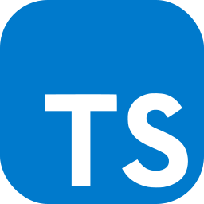

<!-- [](https://countriessundriesapi.com) -->

[](https://www.linkedin.com/in/ariel-britez-diaz-technical/)
[](https://arielbritezdiaz.github.io/portfolio/)

# Countries Sundries API
## Overview
Countries Sundries is an API that offers you information about countries and international organizations, including their flags, their sub-regions, and even their currency. In this section you will find a basic guide to use and the most relevant information for its use.
<!-- [Countries Sundries API](https://countrtiessundriesapi.com) -->

## Getting Started
Check out [Documentation]() for the specifications and get your API key to access the information.

## Usaging API
Example of a simple request for information from countries once we have our API Key.

```js
const fetchApiExample = () => {
  return fetch('http://countriessundries.com/api/v1/country/all', {
    method: 'GET',
    headers: {
      'x-countries_sundries_api-key': 'Bearer x-xxx-xxxx-x',
      'x-api-version': '1'
    }
  })
  .then(response => response.json());
};

fetchApiExample()
  .then(data => console.log(data))
  .catch(error => console.error(error));
```

## Technologies
[](https://nestjs.com/)
[](https://www.mysql.com/)
[](https://bun.sh/)
[](https://www.prisma.io/)
[](https://www.typescriptlang.org/)

[.webp)](https://starlight.astro.build/)
[](https://starlight.astro.build/)
[](https://tailwindcss.com/)

[]()

## Support

## Licence
