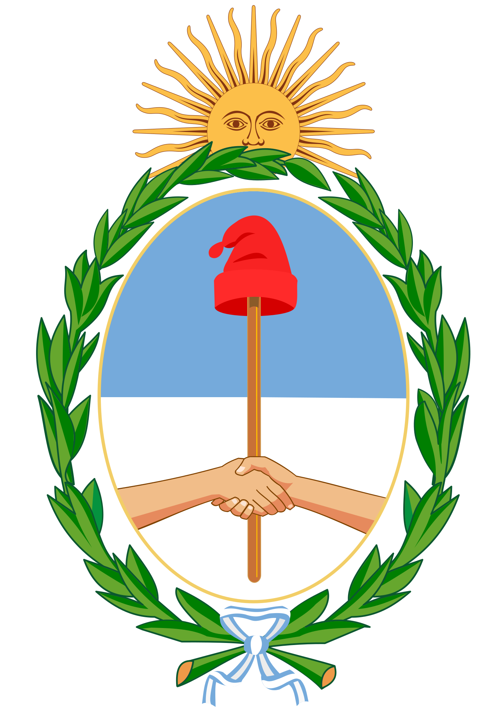

import ExampleCodeImageFlag from '../../../../components/image/flag/flag-code-example.image.astro';

import ExampleCodeImageCoatOfArm from '../../../../components/image/coat-of-arm/coat-of-arm-code-example.image.astro';

In this section we will show you the **`image`** endpoint, its parameters, combinations and specific details.\
At the moment, [Countries Sundries](http://countries-sundries-api.com/) covers a total of 164 images of countries and different international organizations.

## Endpoint response and parameters

This final point will allow you to request both the flag and the country's coat of arm.\
By default, this endpoint will return only one image, either requesting an `image/flag` or `image/coat-of-arm`.


## `image/flag`
This endpoint will return the flag of the country requested.

### Example Request
>We will make an example of a possible API request that could occur if we wanted to bring a flag of a country.\
In this example, we are creating an asynchronous arrow function that will search for the [**Country Sundries**](http://countries-sundries-api.com/) URL with the endpoint `image/flag`.\
We will use an arrow function that will fetch the URL of **Countries Sundries** with the endpoint `image/flag`, using the **'GET'** method and with the headers established, which will be `x-countries_sundries_api-key`, `x-api-version`.\
We will save the result in a constant and return it, this result will be saved in a constant called **'fetchApiExample'** and then call it.

### Response


### Header Parameters
:::note[Remember!]
See the [Global Header Parameters](/docs/api-reference/global-header-parameters) section so you can make these requests correctly and with the necessary permissions.
:::

### Query Parameters
In the Query Parameters sections we will use the [CURL](https://curl.se/) command to show how to use parameters in the request. These query parameter tests will also be possible in [Postman](https://www.postman.com/), [Insomnia](https://insomnia.rest/) or other API testing tools, for example.

#### `id_flag`
>_Optional Integer_\
Allows you to request the flag of a specific country by id.\
```bash
curl -X GET "http://countries-sundries-api.com/image/flag?id_flag=1" -H "x-countries_sundries_api-key: YOUR_API_KEY" -H "x-api-version: 1"
```

#### `name`
>_Optional String_\
Allows you to request the flag of a specific country by name.\
```bash
curl -X GET "http://countries-sundries-api.com/image/flag?name=argentina" -H "x-countries_sundries_api-key: YOUR_API_KEY" -H "x-api-version: 1"
```


## `image/coat-of-arm`
This endpoint will return the coat of arm of the country requested.

### Example Request
>We will make an example of a possible API request that could occur if we wanted to bring a coat of arm of a country.\
In this example, we are creating an asynchronous arrow function that will search for the [**Country Sundries**](http://countries-sundries-api.com/) URL with the endpoint `image/coat-of-arm`.\
We will use an arrow function that will fetch the URL of **Countries Sundries** with the endpoint `image/coat-of-arm`, using the **'GET'** method and with the headers established, which will be `x-countries_sundries_api-key`, `x-api-version`.\

### Response
<div style="display: flex; justify-content: center; align-items: center;">
  
</div>

### Header Parameters
:::note[Remember!]
See the [Global Header Parameters](/docs/api-reference/global-header-parameters) section so you can make these requests correctly and with the necessary permissions.
:::

### Query Parameters
In the Query Parameters sections we will use the [CURL](https://curl.se/) command to show how to use parameters in the request. These query parameter tests will also be possible in [Postman](https://www.postman.com/), [Insomnia](https://insomnia.rest/) or other API testing tools, for example.

#### `id_flag`
>_Optional Integer_\
Allows you to request the flag of a specific country by id.\
```bash
curl -X GET "http://countries-sundries-api.com/image/coat-of-arm?id=1" -H "x-countries_sundries_api-key: YOUR_API_KEY" -H "x-api-version: 1"
```

#### `name`
>_Optional String_\
Allows you to request the flag of a specific country by name.\
```bash
curl -X GET "http://countries-sundries-api.com/image/coat-of-arm?name=argentina" -H "x-countries_sundries_api-key: YOUR_API_KEY" -H "x-api-version: 1"
```