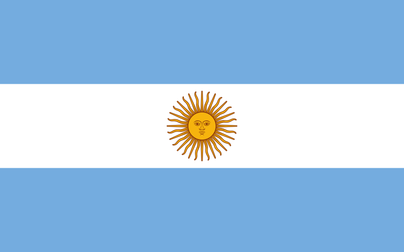

import ExampleCodeImageFlag from '../../../../components/api-endpoints/image/flag/flag-code-example.image.astro';

import ExampleCodeImageCoatOfArm from '../../../../components/api-endpoints/image/coat-of-arm/coat-of-arm-code-example.image.astro';

import GlobalHeaderNote from '../../../../components/aside/note/global-header-params.astro';
import GlobalQueryNote from '../../../../components/aside/note/global-query-params.astro';

import QueryParamsExplanation from '../../../../components/repetitive-texts/query-params-explanation.astro';

In this section we will show you the **`image`** endpoint, its parameters, combinations and specific details.\
At the moment, <a href="/" class="no-underline">Countries Sundries</a> covers a total of 164 images of countries and different international organizations.

## Endpoint response and parameters

This final point will allow you to request both the flag and the country's coat of arm.\
By default, this endpoint will return only one image, either requesting an `image/flag` or `image/coat-of-arm`.


## `image/flag`
This endpoint will return the flag of the country requested.

### Example Request

<ExampleCodeImageFlag />

### Response


### Header Parameters
<GlobalHeaderNote />

### Query Parameters
<QueryParamsExplanation />

#### `id_flag`
>_Optional Integer_\
Allows you to request the flag of a specific country by id.\
```bash
curl -X GET "http://countries-sundries-api.com/image/flag?id_flag=1" -H "x-countries_sundries_api-key: YOUR_API_KEY" -H "x-api-version: 1"
```

#### `name`
>_Optional String_\
Allows you to request the flag of a specific country by name.\
```bash
curl -X GET "http://countries-sundries-api.com/image/flag?name=argentina" -H "x-countries_sundries_api-key: YOUR_API_KEY" -H "x-api-version: 1"
```


## `image/coat-of-arm`
This endpoint will return the coat of arm of the country requested.

### Example Request

<ExampleCodeImageCoatOfArm />

### Response
<div style="display: flex; justify-content: center; align-items: center;">
  
</div>

### Header Parameters
<GlobalHeaderNote />

### Query Parameters
<QueryParamsExplanation />

#### `id_flag`
>_Optional Integer_\
Allows you to request the flag of a specific country by id.\
```bash
curl -X GET "http://countries-sundries-api.com/image/coat-of-arm?id=1" -H "x-countries_sundries_api-key: YOUR_API_KEY" -H "x-api-version: 1"
```

#### `name`
>_Optional String_\
Allows you to request the flag of a specific country by name.\
```bash
curl -X GET "http://countries-sundries-api.com/image/coat-of-arm?name=argentina" -H "x-countries_sundries_api-key: YOUR_API_KEY" -H "x-api-version: 1"
```