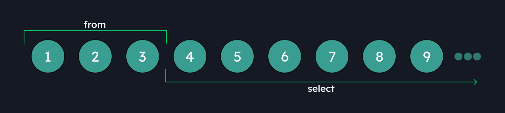
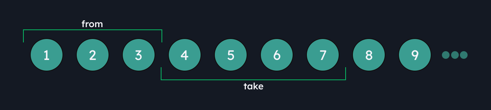

This section details the Query Parameters enabled for all endpoints ending in `/all` provided by [Countries Sundries](http://countries-sundries-api.com/), this with the aim of being able to offer more organized and less repetitive. The examples will be shown with the endpoint that covers all the others, which is `country/all`.\
The Query Parameters that will be enabled are the following:
+ `country/all` (see [Country](/docs/api-docs/country/))
+ `coat-of-arm/all` (see [Coat of Arm](/docs/api-docs/coat-of-arm/))
+ `flag/all` (see [Flag](/docs/api-docs/flag/))
+ `currency/all` (see [Currency](/docs/api-docs/currency/))
+ `region/all` (see [Region](/docs/api-docs/region/))
+ `sub-region/all` (see [Sub Region](/docs/api-docs/sub-region/))

## Query Parameters

### `from`
>_Optional String_\
Allowes you to indicate how many total registers wil be skipped from the available total
```bash
curl -X GET 'http://countries-sundries-api.com/country/all?from=3'
```
`from` will determine from which point we want to take registers and from that starting point the indicated number of registers will be skipped. That is, if we are looking to take `from` 4, we will set 'from' to 3, this will skip 3 registers to take from **4**.

:::caution[Important!]
If the value of `from` is greater than the number of registers, it will skip all the registers and return nothing.
:::

Graphic representation:



### `take`
> _Optional String_\
Select the number of registers to obtain starting with one more than declared
```bash
curl -X GET 'http://countries-sundries-api.com/country/all?take=5'
```
This query parameter is simple, it will only return the number of registers you enter. You enter 5, the server will respond with 5.

:::danger[Attention: Combination of 'from' and 'take'!]
If you take `form` to a value and `take` to one greater than the number of records remaining after jumping with `from`, this will return with the remaining records available; On the other hand, if you take `from` with a value greater than the total number of records, you will be skipping all the available registers, and even using the `take` parameter, nothing will respond.\
If there are 100 registers, set `from` to 89 and set `take` to a value greater than 10, it will respond with those available, in this example only 10 because there is a maximum of 100.
If a number greater than 100 is set, nothing will be returned because there are no more records to skip.
:::

Graphic representation:


### `order_by`
> _Optional String_\
Sorts the registers taking as reference any of the different filtering fields enabled on each endpoint. If it is String, it will return them in alphabetical order (A, B, C, D, ...), and if it is Integer, it will return them in order from least to greatest (1, 2, 3, 4, ...). By default, it is set to ID reference and ASC order.
```bash
curl -X GET 'http://countries-sundries-api.com/country/all?order_by=id'
```

### `order_direction`
> _Optional String_\
Sorts registers in ascending (asc) or descending (desc) order. By default it is set to **asc**.
```bash
curl -X GET 'http://countries-sundries-api.com/country/all?order_direction=asc'
```